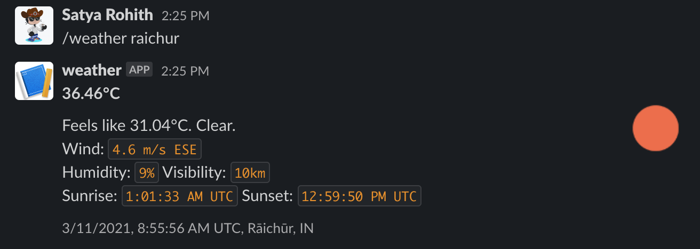
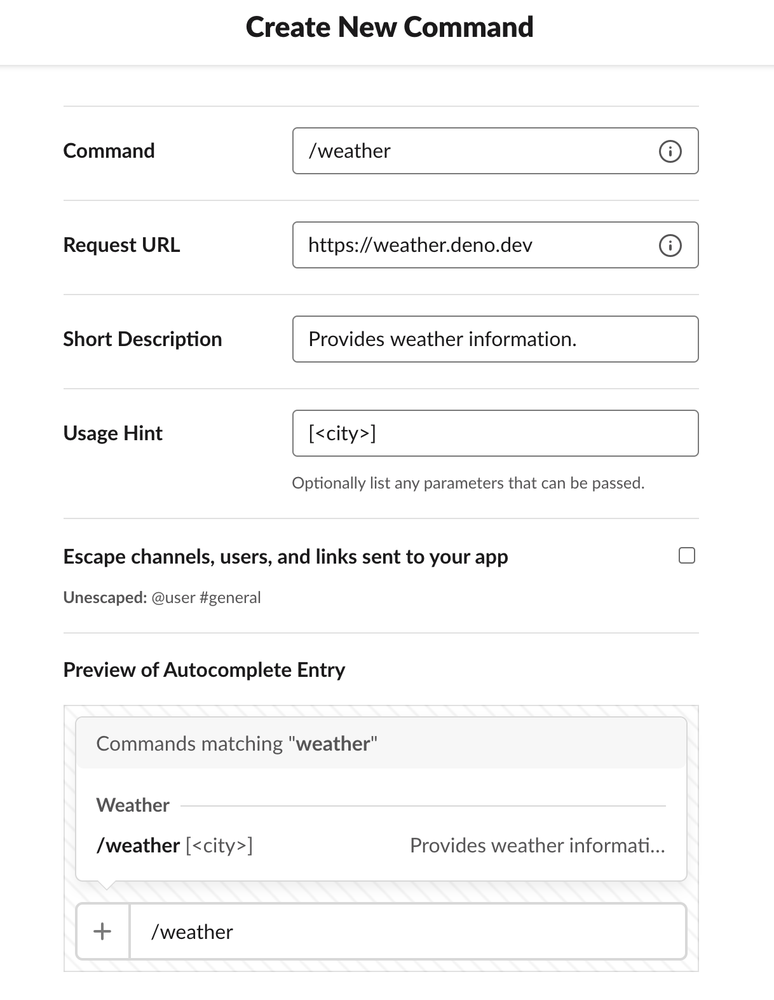

# Slack Slash Command Example

**Weather** - A Slack Slash Command to access weather information.



- [Try Live Version](#try-live-version)
- [Run Offline](#run-offline)

## Try Live Version

We've a version deployed at https://weather.deno.dev for demo. You can use it to
create the Slash Command in your Slack workspace.

### Installation

Go to https://api.slack.com/apps?new_app and create an app. After successful app
creation, click on "Slash Commands" section and fill out the details as shown
below.



After filling the details click on "Save" button that might at bottom right of
the page. That's it!

### Usage

After the Slack App is setup with the Slash command, run the below command to
get weather information of a place.

```
/weather [<city>]
```

Additionally, you can avoid passing the city argument to get weather information
of a random city from the [list](cities.js).

## Run Offline

You can run the application on your local machine using
[`deployctl`](https://github.com/denoland/deployctl).

```
OPEN_WEATHER_TOKEN=<token> deployctl run --libs=ns,fetchevent https://raw.githubusercontent.com/denoland/deploy_examples/main/slack/mod.ts
```

Grab a token at https://openweathermap.org and set the value for the variable.

To be able to use the local version on your Slack workspace, you need to use a
tool like [ngrok](https://ngrok.com) to tunnel Slack requests to the app running
on your machine.

1. Run `ngrok http 8000` (assuming that the application is running on port
   `8000`)
2. Follow the steps under Installation section, but use the https URL output by
   ngrok for **Request URL** field.

That's it.
