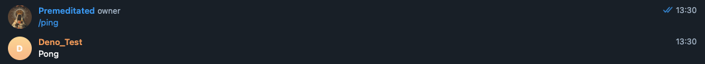

# Telegram Bot Command

A simple Telegram Bot Command.

## Tutorial

1. Follow the
  [official Telegram guide](https://core.telegram.org/bots#3-how-do-i-create-a-bot)
  for creating a Bot.
- Deploy the Bot by clicking on this button: [](https://dash.deno.com/new?url=https://raw.githubusercontent.com/denoland/deploy_examples/main/telegram/mod.ts&env=TOKEN,BOT_NAME)
- Input TOKEN and BOT_NAME env variable field. The token value should be
  available from the BotFather. The bot name is the bot username that ends with either `_bot` or `Bot`.
  or `Bot`.
- Click on **Create** to create the project, then on **Deploy** to deploy the
  script.
- Grab the URL that's displayed under Domains in the Production Deployment card.
- Visit the following URL (make sure to replace the template fields):
-
  - `https://api.telegram.org/bot<YOUR_TOKEN>/setWebhook?url=<DOMAIN_NAME>/<YOUR_TOKEN>`
- Add a command to the bot by visiting the following URL:
-
  - `https://api.telegram.org/bot<YOUR_TOKEN>/setMyCommands?commands=[{"command":"ping","description":"Should return a 'pong' from the Bot."}]`
- Now you can invite the bot to a Group Chat or just PM the bot with the
  following command "/ping".
-



## Run Offline

You can run the example program on your machine using
[`deployctl`](https://github.com/denoland/deployctl):

```sh
deployctl run https://raw.githubusercontent.com/denoland/deploy_examples/main/telegram/mod.ts
```
